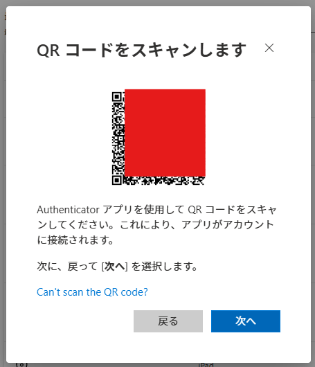

## overview

**AIと作成**

WebClassから取得した課題を任意のTeamsチャネルで通知します。
主に高専の人向け

1. WebClassスクレイピングで課題を取得 & Microsoftアカウントログイン
2. 整形してResendからメールを送信
3. teamsに通知が行く

簡単にこんな流れです。

## env
- Ubuntu 22.04.5 LTS
- Node v22.15.0
    - pupperteer 24.34.0
    - resend 6.7.0


## setup
0. ワークフローの作成
1. チャネルのメールアドレス取得
2. ドメインの取得
3. Resendに登録
4. 環境構築
5. OTP認証
6. 確認

0が結構くせもので、Microsoftは組織が強いのでもしかしたら登録できない可能性は高いです。高専機構ではいけるかも

あと5は必ずMFAコードを用いたログイン形式にしておくこと


### 0.ワークフローの作成
送りたいチャネルの右にある3つの点 > ワークフロー


\> 自分のメールをチャネルに転送する


\> 次へ （ここちょっと時間かかる） 


チームとチャネル適当に選択して ワークフローを追加する


ここまで来たらオッケー


組織で制限されてたらここまで来れない、ワークフロー作れなそうなら諦める


### 1.メールアドレスの作成

最初の画像のところにあるメールアドレスを取得、< >で囲われたメールアドレスをコピーしておく

詳細から一応ドメインから絞れるけど一旦「だれでも」にしとく


### 2.ドメインの取得

このプロジェクトではプログラムからAPIを通してメール送るので独自ドメインから送信した方が楽です

GmailやoutlookとかのドメインからはOAUTHなどでAPIが複雑になりそうです。あとドメインのほうがかっこいい

どこでもいいですが、cloudflareから取るのが安くておすすめです

### 3.Resendに登録

さっきからResend言ってますが、主に開発者のためのメール配信APIのことです。
コードを数行書くだけでメールが送信できます。

https://resend.com/

サインアップした後、ドメインも登録します。ここでは説明しません。

もしDNSをcloudflare使っているのであれば簡単にDNSに登録することができます。
右にあるSign in to Cloudflareをクリックしてログインするだけです。

**必ずDMARCも登録する必要があります！** 

cloudflareログインではDMARCレコードが自動で作成されないので手動で登録します

DMARCを登録しないと普通迷惑メールに振り分けられるようで、その場合は正常に通知されません


### 4.環境構築

このリポジトリをクローンします

そしたらnode環境を整えます
```bash
npm install
```

.envの作成
```bash
cat << EOF > .env
USER_ID='{your_ID}'
PASSWORD='{your_password}'
APIKEY='{Resend_APIKEY}'
SENDFROM='notification@{your_domain}'
SENDTO='{channel_mailaddress}'
MFA_SECRET='{MFA_SECRET}'
EOF
```

.envに以下を設定します
```
USER_ID='{your_ID}'
PASSWORD='{your_password}'
APIKEY="{Resend_APIKEY}"
SENDFROM="notification@{your_domain}"
SENDTO="{channel_mailaddress}"
MFA_SECRET='{MFA_SECRET}'
```

| .env     | 用途                                                       | 
| -------- | ---------------------------------------------------------- | 
| USER_ID  | Microsoftアカウントのメールアドレス                        | 
| PASSWORD | Microsoftアカウントのパスワード                            | 
| APIKEY   | ResendのAPIKEY                                             | 
| SENDFROM | ドメインのメールアドレス | 
| SENDTO   | チャネルのメールアドレス                                   | 
| MFA_SECRET   | 後述するシークレット                                   | 


SENDFROMのnotificationの部分はなんでもいいです


### 5. OTP認証

Microsoft のOTP認証を通します

このリンクにアクセスします：

https://mysignins.microsoft.com/security-info

サインイン方法の追加 > Microsoft Authenticator > **別の認証アプリを設定する** > 次へ

そうするとQRコードが表示されます。



Google Authenticator などの認証アプリを使用してこのQRコードを読み取ると同時に、下にあるCan't scan the QR code? をクリックし、秘密鍵をコピー、 .envの`MFA_SECRET`に貼り付けます。

次へボタンを押すとOTPの入力を促されるので認証アプリに表示されている認証コードを入力、承認されたら認証アプリの認証情報は消して構いません。

ここで注意するのが、Microsoft Authenticator はこのプログラム内での認証とは違います。必ず**別の認証アプリを設定する**をクリックしてください！

### 6. 確認

`$ node --env-file=.env index.js`

cookieが切れる or `cookies.json`が存在しない(初回実行) の場合のみOTP認証されます。

変なことしない限りおそらくOTP認証は通るはずなので、一応ほったらかしでも認証は切れないようになってます。


### 補足
teamsのフックに直接メールを送信する方法について、
独自ドメインからのメールはスパム対策に厳しく、簡単にブロックされる可能性があります（実際に僕は一度ブロックされました）

また受取失敗や、スパム判定で蹴られた際に状況が分からないなどいろいろ不便なことがあります。

回避策としてoutlookやGmailに一度送信し、そこから転送設定でチャネルメールアドレスに転送する方法があります

必要に応じて対応してみてください

#### 追記
- 結局ローカルサーバでcrontabする方法で落ち着きました。半月ほど動かしましたが、正常に機能しています。
  - どうやらHDDが故障し、IOエラーが出るようになりました。そのためgithub actionsでのcronで回す方法を検討しました。

- github actionsで動かせるように`.github/workflows/cron.yml`に置いときました。使うときは`disable`を外してください


- 2026/5/18 github actionsはどうやらcronがとても不安定なようで、10分間隔で設定したものが最低1時間間隔、夜間になると4時間くらい平気で動かないことがあります。（夜間に課題が配信されることはないけど！）
  - oracle cloudの always free プランに移行しました。当分無料である程度のコンピューティングが使える様です。そのため、ライブラリ関係も軽いものに変更しました。


## contact
`22126@yonago.kosen-ac.jp`