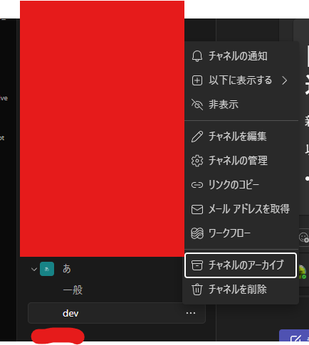
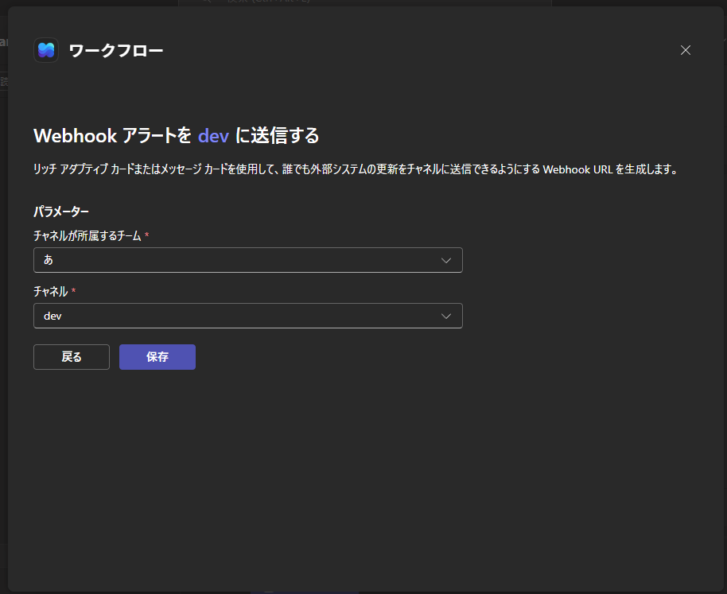
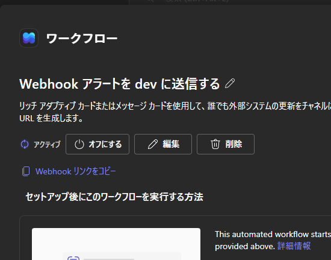

## overview

**AIと作成**

WebClassから取得した課題を任意のTeamsチャネルで通知します。
主に高専の人向け

1. WebClassスクレイピングで課題を取得 & Microsoftアカウントログイン
2. 整形してTeams Webhookへ送信
3. teamsに通知が行く

簡単にこんな流れです。

## env
- Ubuntu 22.04.5 LTS
- Node v22.15.0
    - pupperteer 24.34.0
  
```
libasound2=1.2.6.1-1ubuntu1.1
libasound2-data=1.2.6.1-1ubuntu1.1
libatk-bridge2.0-0=2.38.0-3
libatk1.0-0=2.36.0-3build1
libatk1.0-data=2.36.0-3build1
libcups2=2.4.1op1-1ubuntu4.20
libgbm1=23.2.1-1ubuntu3.1~22.04.3
libgtk-3-0=3.24.33-1ubuntu2.2
libgtk-3-bin=3.24.33-1ubuntu2.2
libgtk-3-common=3.24.33-1ubuntu2.2
libnss-systemd=249.11-0ubuntu3.21
libnss3=2:3.98-0ubuntu0.22.04.3
libpango-1.0-0=1.50.6+ds-2ubuntu1
libpangocairo-1.0-0=1.50.6+ds-2ubuntu1
libpangoft2-1.0-0=1.50.6+ds-2ubuntu1
libxcomposite1=1:0.4.5-1build2
libxdamage1=1:1.1.5-2build2
libxfixes3=1:6.0.0-1
libxkbcommon0=1.4.0-1
libxrandr2=2:1.5.2-1build1
libxss1=1:1.2.3-1build2
```

npmのライブラリ詳しくは `package.json` を参照してね


## setup
<!-- 0. ワークフローの作成 -->
1. Webhook URLの取得
2. 環境構築
3. OTP認証
4. 確認

学校の権限によっては1のWebhookが作成できない可能性はあります

<!-- 0が結構くせもので、Microsoftは組織が強いのでもしかしたら登録できない可能性は高いです。高専機構ではいけるかも

あと5は必ずMFAコードを用いたログイン形式にしておくこと -->


<!-- ### 0.ワークフローの作成
送りたいチャネルの右にある3つの点 > ワークフロー


\> 自分のメールをチャネルに転送する


\> 次へ （ここちょっと時間かかる） 


チームとチャネル適当に選択して ワークフローを追加する


ここまで来たらオッケー


組織で制限されてたらここまで来れない、ワークフロー作れなそうなら諦める -->


### 1.Webhook URLの取得
TeamsのチャネルにはWebhookを提供するワークフローがあります。それを追加しましょう。

チャネルの点々をクリック > ワークフロー



チームとチャネルを設定



保存をクリック




しばらくするとワークフローの設定に遷移します。Webhook リンクをコピー をクリックし、控えておきます。


### 2.環境構築

パッケージをインストールします。aptを使ってます。

```
sudo apt-get install -y \
    libatk1.0-0 libatk-bridge2.0-0 libcups2 libxss1 \
    libgtk-3-0 libnss3 libasound2 libgbm1 \
    libxkbcommon0 libxcomposite1 libxdamage1 \
    libxfixes3 libxrandr2 libpango-1.0-0
```


インストールができたら、このリポジトリをクローンします

node環境を整えます

```bash
$ npm install
```

.envの作成
```bash
cat << EOF > .env
USER_ID='{your_ID}'
PASSWORD='{your_password}'
TEAMS_WEBHOOK_URL='{teams_webhook_url}'
MFA_SECRET='{MFA_SECRET}'
EOF
```

.envに以下を設定します
```
USER_ID='{your_ID}'
PASSWORD='{your_password}'
TEAMS_WEBHOOK_URL='{teams_webhook_url}'
MFA_SECRET='{MFA_SECRET}'
```

| .env     | 用途                                                       | 
| -------- | ---------------------------------------------------------- | 
| USER_ID  | Microsoftアカウントのメールアドレス                        | 
| PASSWORD | Microsoftアカウントのパスワード                            | 
| TEAMS_WEBHOOK_URL | Teamsで発行したWebhook URL                       | 
| MFA_SECRET   | 後述するシークレット                                   | 


### 3. OTP認証

Microsoft のOTP認証を通します

このリンクにアクセスします：

https://mysignins.microsoft.com/security-info

サインイン方法の追加 > Microsoft Authenticator > **別の認証アプリを設定する** > 次へ

そうするとQRコードが表示されます。


Google Authenticator などの認証アプリを使用してこのQRコードを読み取ると同時に、下にあるCan't scan the QR code? をクリックし、秘密鍵をコピー、 .envの`MFA_SECRET`に貼り付けます。

次へボタンを押すとOTPの入力を促されるので認証アプリに表示されている認証コードを入力、承認されたら認証アプリの認証情報は消して構いません。

ここで注意するのが、Microsoft Authenticator はこのプログラム内での認証とは違います。必ず**別の認証アプリを設定する**をクリックしてください！

イメージとしては初回だけアプリで認証、次回以降は `src/otp.js` で代理認証、みたいな感じです。グレーっちゃグレーです

### 4. 確認

`$ node --env-file=.env index.js`

cookieが切れる or `cookies.json`が存在しない(初回実行) の場合のみOTP認証されます。

変なことしない限りおそらくOTP認証は通るはずなので、一応ほったらかしでも認証は切れないようになってます。


### 補足
Teams Webhook経由で通知するため、メール転送の設定は不要です。

#### 追記
- 結局ローカルサーバでcrontabする方法で落ち着きました。半月ほど動かしましたが、正常に機能しています。
  - どうやらHDDが故障し、IOエラーが出るようになりました。そのためgithub actionsでのcronで回す方法を検討しました。

- github actionsで動かせるように`.github/workflows/cron.yml`に置いときました。使うときは`disable`を外してください


- 2026/5/18 github actionsはどうやらcronがとても不安定なようで、10分間隔で設定したものが最低1時間間隔、夜間になると4時間くらい平気で動かないことがあります。（夜間に課題が配信されることはないけど！）
  - oracle cloudの always free プランに移行しました。当分無料である程度のコンピューティングが使える様です。そのため、ライブラリ関係も軽いものに変更しました。

- 2026/05/xx Webhookでの通知方法に変更しました。 `src/sender.js`などがありますが、レガシーです。

## contact
`22126@yonago.kosen-ac.jp`